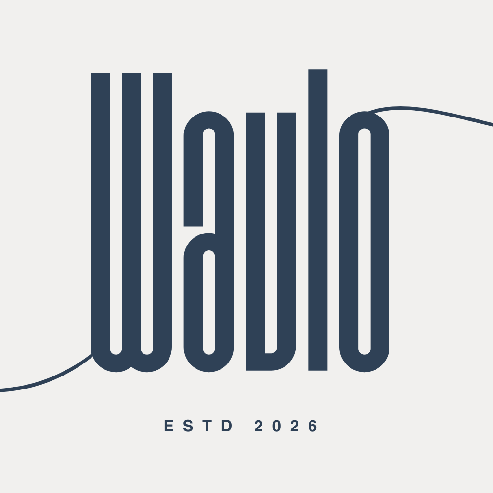

<p align="center">
  
</p>

<h1 align="center">Wavlo</h1>

<p align="center">
  <strong>AI-Powered Music Streaming for iOS</strong><br/>
  Discover, stream, and vibe — intelligently.
</p>

<p align="center">
  
  
  
  
  
  
</p>

---

## Overview

**Wavlo** is a full-featured iOS music streaming application built with SwiftUI and Swift Concurrency. It streams music from JioSaavn's catalog, powered by a multi-layer on-device ML recommendation engine and an AI DJ backed by Google Gemini. Wavlo blends intelligent personalization with a clean, theme-aware interface to create a modern listening experience.

> **Spotify playlists? Import them directly.** Wavlo includes a native CSV importer so you can bring your existing playlists into the app in seconds.

---

## Features

### Music Playback
- AVQueuePlayer-based audio streaming with gapless and crossfade support
- Auto-queue refill — maintains a live queue of 5+ songs without interruption
- Shuffle, repeat, and playback speed controls
- Sleep timer with configurable duration
- Lock screen & Control Center integration via `MPRemoteCommandCenter`
- Dominant colour extraction from album art for immersive Now Playing gradients
- Bluetooth, AirPlay, and speaker route detection

### AI DJ — Wavlo DJ
- Conversational music discovery powered by **Google Gemini Flash**
- Understands mood, context, and Hinglish
- Generates curated song suggestions from natural language requests
- Maintains conversational context across the chat session

### Smart Recommendations
A 4-layer hybrid recommendation engine runs entirely on-device:

| Layer | Technology | Purpose |
|---|---|---|
| 1 | JioSaavn Suggestions | Seed-song based discovery |
| 2 | Artist Expansion | Related-artist catalogue crawl |
| 3 | Gemini LLM | Contextual & emotional matching |
| 4 | ML Scoring | Personalised re-ranking from listening history |

On-device ML components include mood detection, skip prediction, contextual ranking, and feature extraction (tempo, energy, valence, danceability).

### Music Discovery
- **Home Feed** — Jump back in (recently played) + curated recommendation modules
- **Search** — Full-text search + genre browsing with filter chips
- **Mood Selector** — Explore music by emotional context
- **Because You Liked** — Content-based seeds from a chosen song

### Library Management
- Liked Songs smart collection
- Create, rename, delete, and reorder custom playlists
- Add or remove songs from any playlist
- **Spotify Playlist Import** — export via Exportify (CSV), import directly into Wavlo

### Personalization
- Preferred genres and language settings
- Listening history with play-completion ratios
- Private session mode
- Dark & Light theme with persistent preference
- Bring your own Gemini API key in Settings

### Authentication
- Email / password signup & login with email verification
- Google Sign-In via Firebase
- Secure password reset flow

---

## Architecture

```
Wavlo/
├── Models/                  # SwiftData @Model entities
│   ├── Song.swift
│   ├── Playlist.swift
│   ├── ListeningHistory.swift
│   └── UserPreferences.swift
│
├── Services/                # Business logic & external integrations
│   ├── AuthService.swift            Firebase Auth + Google Sign-In
│   ├── JioSaavnService.swift        Music search & streaming
│   ├── GeminiService.swift          Gemini AI completions
│   ├── AudioPlayerService.swift     AVQueuePlayer wrapper (actor)
│   ├── RecommendationEngine.swift   4-layer hybrid recommender
│   ├── AutoQueueManager.swift       Live queue refill logic
│   ├── LyricsService.swift          Lyrics fetching
│   ├── VoiceInputService.swift      Voice input for AI DJ
│   ├── SpotifyCSVImportService.swift RFC 4180 CSV import + JioSaavn matching
│   └── MLRecommendation/
│       ├── WavloMLEngine.swift
│       ├── MLRecommenderLayer.swift
│       ├── SkipPredictorLayer.swift
│       ├── ContextualRanker.swift
│       ├── MoodDetector.swift
│       ├── SongMLFeatures.swift
│       └── ListeningTracker.swift
│
├── ViewModels/              # @MainActor ObservableObject MVVM layer
│   ├── AuthViewModel.swift
│   ├── PlayerViewModel.swift        Singleton – playback state & remote control
│   ├── HomeViewModel.swift
│   ├── SearchViewModel.swift
│   ├── LibraryViewModel.swift
│   ├── AIDJViewModel.swift
│   └── ImportPlaylistViewModel.swift
│
├── Views/                   # SwiftUI views grouped by feature
│   ├── Auth/
│   ├── Onboarding/
│   ├── Home/
│   ├── Search/
│   ├── Library/
│   ├── Player/
│   ├── AIDJ/
│   ├── Settings/
│   └── Components/
│
└── Utilities/
    ├── Constants.swift              Global constants, typography, layout, API config
    ├── Extensions+Color.swift       ThemeManager, WavloColors, hex initializer
    ├── Extensions+View.swift        Reusable view modifiers
    └── ValidationHelper.swift       Input validation
```

**Key patterns:**
- **Swift Concurrency** throughout — `actor`, `async/await`, `withTaskGroup`, `@MainActor`
- **SwiftData** for persistence with `@Attribute(.unique)` and `FetchDescriptor`
- **MVVM** with `ObservableObject` / `@Published` bindings
- **Environment-driven config** — secrets loaded from `.env` at build time

---

## Tech Stack

| Component | Technology |
|---|---|
| Language | Swift 5.0 |
| UI Framework | SwiftUI |
| Persistence | SwiftData |
| Audio | AVFoundation — AVQueuePlayer |
| Lock Screen / Control Center | MediaPlayer — MPRemoteCommandCenter |
| Authentication | Firebase Auth + GoogleSignIn SDK |
| Analytics / Crash Reporting | Firebase Analytics, Crashlytics |
| AI / LLM | Google Gemini Flash API |
| Music Catalog | JioSaavn API (self-hosted proxy) |
| Dependency Management | Swift Package Manager |
| Minimum iOS | 17.6 |

---

## Dependencies

All dependencies are managed via **Swift Package Manager** and pinned in `Package.resolved`.

| Package | Version | Purpose |
|---|---|---|
| Firebase iOS SDK | 12.11.0 | Auth, Analytics, Crashlytics, Performance, Remote Config |
| GoogleSignIn-iOS | 9.1.0 | Google OAuth authentication |
| gRPC Swift | 1.69.1 | Firebase gRPC transport |
| Abseil C++ | 1.2024072200.0 | Firebase C++ internals |
| AppAuth iOS | 2.0.0 | OAuth 2.0 / OIDC support |
| LevelDB | – | Firebase local storage |
| Nanopb | – | Protocol Buffers for Firebase |

---

## Getting Started

### Prerequisites

- Xcode 16.0 or later
- iOS 17.6+ device or simulator
- Active Firebase project
- JioSaavn API proxy (self-hosted or compatible endpoint)
- Google Gemini API key

### Setup

1. **Clone the repository**
   ```bash
   git clone https://github.com/your-username/Wavlo.git
   cd Wavlo
   ```

2. **Configure environment variables**

   Copy the example file and fill in your values:
   ```bash
   cp .env.example .env
   ```

   `.env` keys:
   ```
   GEMINI_API_KEY=your_gemini_api_key
   JIOSAAVN_BASE_URL=https://your-jiosaavn-proxy.vercel.app/api
   FIREBASE_API_KEY=your_firebase_api_key
   BACKEND_BASE_URL=https://your-backend-url
   ```

3. **Add `GoogleService-Info.plist`**

   Download from your Firebase console and place it in the `Wavlo/` directory.

4. **Open in Xcode**
   ```bash
   open Wavlo.xcodeproj
   ```

5. **Resolve packages**

   Xcode will automatically fetch SPM dependencies. If they fail to resolve:
   `File → Packages → Reset Package Caches`

6. **Build & Run**

   Select your target device and press `⌘R`.

---

## Importing a Spotify Playlist

1. Export your Spotify playlist using [Exportify](https://exportify.net) — this generates a `.csv` file in Exportify column format.
2. Open Wavlo → **Library** tab → tap the download icon (top-right).
3. Select **Choose CSV File** and pick your exported file.
4. Wavlo matches each track against JioSaavn's catalogue in batches with live progress.
5. Review matched and unmatched songs, name your playlist, and tap **Save Playlist**.

---

## Design System

Wavlo uses a custom design system defined in `Constants.swift` and `Extensions+Color.swift`.

### Color Palette

| Token | Dark Mode | Light Mode |
|---|---|---|
| `bgPrimary` | `#2A2A2A` (Obsidian) | `#F5EFEB` (Beige) |
| `textPrimary` | `#F5EFEB` (Beige) | `#2F4156` (Navy) |
| `primaryAccent` | `#D9ED92` (Lime Green) | `#567C8D` (Teal) |
| `bgCard` | Elevated obsidian | Elevated beige |
| `bgInput` | Soft obsidian | Soft beige |

### Typography

Predefined text styles map to named constants: `displayMedium`, `titleLarge`, `titleMedium`, `bodyLarge`, `bodyRegular`, `bodySmall`, `pill`.

---

## Project Info

| Field | Value |
|---|---|
| Bundle ID | `com.vatsalya.Wavlo` |
| Version | `1.0` (Build 1) |
| Swift Version | `5.0` |
| Deployment Target | iOS 17.6 |
| Google Client ID | Configured via `GoogleService-Info.plist` |

---

## Roadmap

- [ ] Apple Music & Spotify OAuth integration
- [ ] Collaborative playlists
- [ ] Social listening / Friend activity
- [ ] Offline playback with download manager
- [ ] CarPlay support
- [ ] Widget & Live Activity for Now Playing
- [ ] Android / cross-platform expansion

---

## License & Copyright

```
Copyright © 2024 Vatsalya Dabhi. All Rights Reserved.

This software and its source code are the exclusive intellectual property
of Vatsalya Dabhi. No part of this codebase — including but not limited
to source files, assets, design assets, or documentation — may be
reproduced, distributed, modified, sublicensed, or used in any form
without the express prior written permission of the copyright holder.

Unauthorised copying, distribution, or commercial use of this software
is strictly prohibited and may be subject to legal action.

For licensing inquiries, contact: vatsalyadabhi@example.com
```

> **You may not use, copy, distribute, or modify this project without explicit written permission from the author.**

---

<p align="center">
  Built with passion by <strong>Vatsalya Dabhi</strong>
</p>
